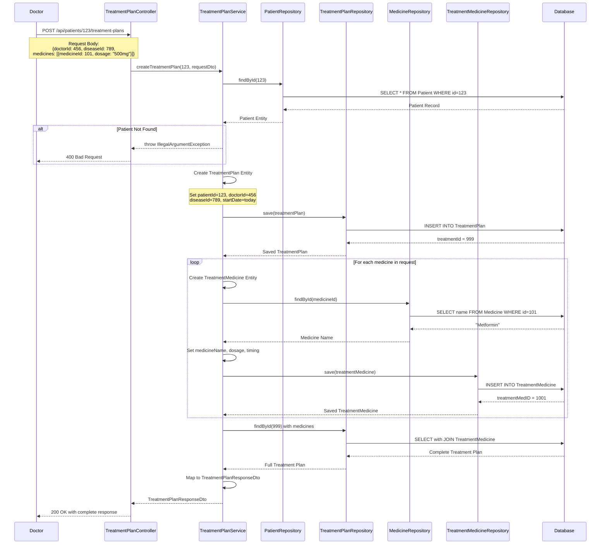

# 📋 Treatment Plan API - Interactive Flow Diagram

## 🔄 Complete API Sequence Flow



## 🎯 Real-World Scenario Walkthrough

### Scenario: Dr. Smith treats John Doe for Diabetes

#### Step 1: Doctor Initiates Treatment
```
👨‍⚕️ Dr. Smith (ID: 456) 
   ↓
📋 Diagnoses John Doe (Patient ID: 123) with Type 2 Diabetes (Disease ID: 789)
   ↓
💊 Prescribes:
   • Metformin 500mg (Medicine ID: 101) - Twice daily with meals
   • Insulin 10 units (Medicine ID: 102) - Before breakfast
```

#### Step 2: API Call Made
```http
POST http://localhost:8080/api/patients/123/treatment-plans
Content-Type: application/json

{
    "doctorId": 456,
    "diseaseId": 789,
    "status": "ongoing",
    "notes": "Monitor blood glucose levels daily. Follow diabetic diet strictly.",
    "medicines": [
        {
            "medicineId": 101,
            "dosage": "500mg",
            "timing": "Twice daily with meals"
        },
        {
            "medicineId": 102,
            "dosage": "10 units",
            "timing": "Before breakfast"
        }
    ]
}
```

#### Step 3: System Processing
```
🔍 Validation:
   ✅ Patient ID 123 exists → John Doe found
   ✅ Request data is valid

💾 Database Operations:
   1️⃣ INSERT TreatmentPlan:
      • treatmentId: 999 (auto-generated)
      • patientId: 123 → Links to John Doe
      • doctorId: 456 → Links to Dr. Smith
      • diseaseId: 789 → Type 2 Diabetes
      • status: "ongoing"
      • startDate: "2025-08-01" (today)
      • notes: "Monitor blood glucose levels..."

   2️⃣ INSERT TreatmentMedicine #1:
      • treatmentMedID: 1001 (auto-generated)
      • treatmentID: 999 → Links to treatment plan
      • medicineName: "Metformin" (fetched from Medicine table)
      • dosage: "500mg"
      • timing: "Twice daily with meals"

   3️⃣ INSERT TreatmentMedicine #2:
      • treatmentMedID: 1002 (auto-generated)
      • treatmentID: 999 → Links to treatment plan
      • medicineName: "Insulin" (fetched from Medicine table)
      • dosage: "10 units"
      • timing: "Before breakfast"
```

#### Step 4: Response Generated
```json
HTTP 200 OK
{
    "treatmentId": 999,
    "patientId": 123,
    "doctorId": 456,
    "diseaseId": 789,
    "status": "ongoing",
    "startDate": "2025-08-01",
    "notes": "Monitor blood glucose levels daily. Follow diabetic diet strictly.",
    "medicines": [
        {
            "treatmentMedID": 1001,
            "medicineName": "Metformin",
            "dosage": "500mg",
            "timing": "Twice daily with meals"
        },
        {
            "treatmentMedID": 1002,
            "medicineName": "Insulin",
            "dosage": "10 units",
            "timing": "Before breakfast"
        }
    ]
}
```

## 📊 Data Relationships After Creation

```
John Doe (Patient)
├── Personal Info
│   ├── patientId: 123
│   ├── name: "John Doe"
│   ├── age: 45
│   └── gender: "Male"
│
└── Treatment Plans
    └── Treatment Plan #999
        ├── Doctor: Dr. Smith (ID: 456)
        ├── Disease: Type 2 Diabetes (ID: 789)
        ├── Status: ongoing
        ├── Start Date: 2025-08-01
        ├── Notes: "Monitor blood glucose..."
        │
        └── Prescribed Medicines
            ├── Medicine #1001
            │   ├── Name: Metformin
            │   ├── Dosage: 500mg
            │   └── Timing: Twice daily with meals
            │
            └── Medicine #1002
                ├── Name: Insulin
                ├── Dosage: 10 units
                └── Timing: Before breakfast
```

## 🔗 Database Foreign Key Relationships

```sql
-- TreatmentPlan table references Patient
TreatmentPlan.patient_id → Patient.patientId

-- TreatmentMedicine table references TreatmentPlan
TreatmentMedicine.treatment_id → TreatmentPlan.treatmentId

-- Medicine lookup (no direct FK, but logical relationship)
TreatmentPlan.medicines.medicineId → Medicine.medicineId (for name lookup)
```

## ⚠️ Error Handling Scenarios

### 1. Patient Not Found
```
Input: patientId = 999 (doesn't exist)
Output: HTTP 400 Bad Request
Body: "Patient not found"
```

### 2. Medicine Not Found
```
Input: medicineId = 999 (doesn't exist)
Result: medicineName = null (stored in database)
Note: Treatment still created, but medicine name is empty
```

### 3. Database Transaction Failure
```
Scenario: TreatmentPlan saves, but TreatmentMedicine fails
Result: Entire transaction rolled back
Output: HTTP 500 Internal Server Error
Body: "Failed to create treatment plan: [error details]"
```

## 🎯 Key Benefits of This Design

1. **🔗 Complete Traceability**: Every medicine is linked to a specific treatment plan and patient
2. **📊 Structured Data**: Consistent format for dosages, timing, and notes
3. **🔒 Data Integrity**: Foreign key relationships ensure data consistency
4. **🔄 Transactional Safety**: All-or-nothing approach prevents partial data
5. **📱 API-First**: Clean REST endpoints for easy integration
6. **🏥 Medical Compliance**: Structured format suitable for healthcare systems
